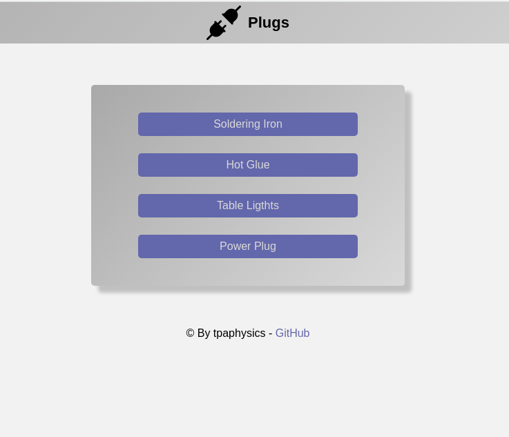

# Basic responsive front-end for ESP8266 and ESP32 devices.
### Simulation
Basic responsive front-end for ESP8266 and ESP32 devices.
By activating the buttons on the interface, we are able to change the state of gpios. 
When GPIOs are at a high logic level the button is green and when the logic level is low the button is gray.
The front-end detects state changes every 10 seconds.It has an API written in javascript that simulates GPIO states.



### To run the API:

```
npm install && node server.js
```

# License

Licensed under the MIT [licence.](https://github.com/tpaphysics/toogleESP32/blob/master/LICENSE)

